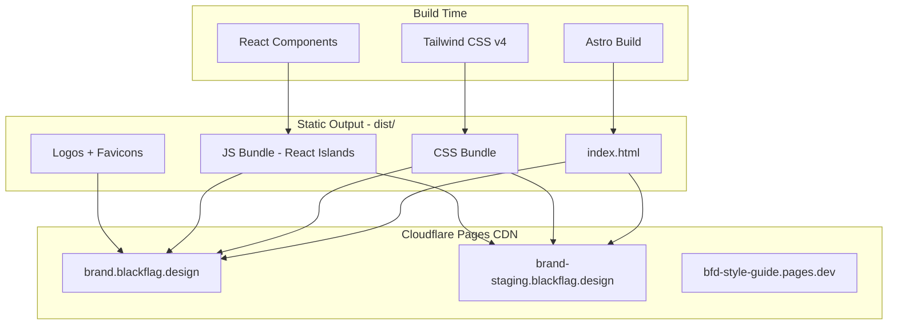
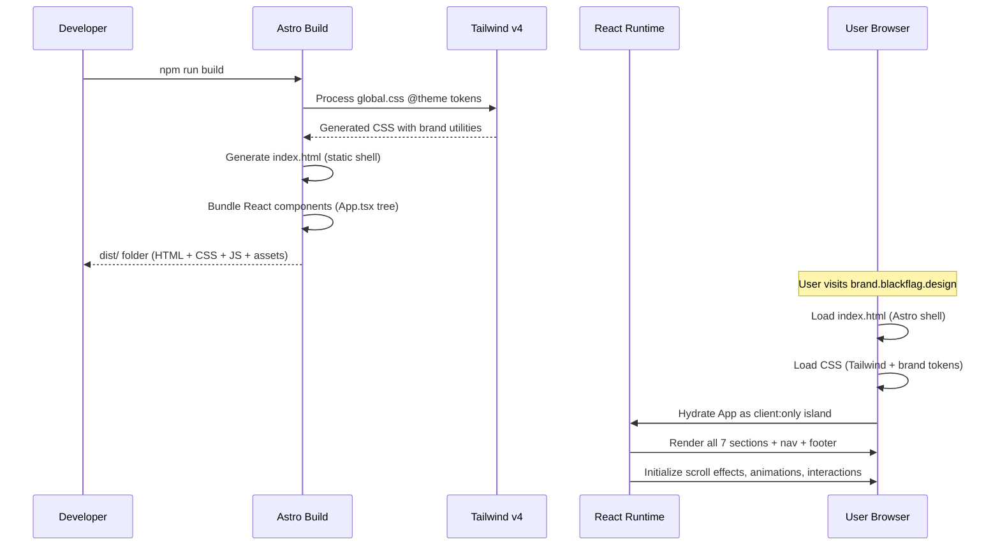

# Skill: Project Architecture

> Use when you need to understand the big picture of how this project is built, why specific technologies were chosen, and how all the pieces fit together. Read this first if you are new to the codebase.

**Last verified: February 2026**
**Maintainer obligation: Update this file whenever you change the framework, build tool, hosting provider, or project structure. If this file is wrong, the next developer will make wrong assumptions.**

---

## What This Project Is

The Black Flag Design Style Guide is a **single-page brand guidelines application** that documents the visual identity system for Black Flag Design. It shows logo variants, the color palette (organized by 80-10-10 rule), typography scale, motion principles, component patterns, and voice & tone guidelines.

It is a **static site** — no database, no API, no authentication, no server-side logic. It generates HTML/CSS/JS at build time and serves them from a CDN.

---

## Architecture Overview



---

## Why Astro 5

**Decision date: February 2026**

1. **No server needed.** This is a brand guidelines page. Static HTML generation at build time is all that's required. Zero runtime infrastructure.

2. **Consistency with sibling projects.** The monorepo runs multiple Astro projects (hw-style-guide, hsw-site-cms). Same stack = one set of patterns to learn.

3. **Simpler deployment.** Static files on Cloudflare Pages = zero infrastructure management. No Docker, no VMs, no health checks, no auto-scaling config.

4. **React components preserved.** Astro's island architecture lets us use React for all interactive components (framer-motion animations, scroll-driven effects, interactive color tabs). The entire app loads as a single `client:only="react"` island.

**What we explicitly chose NOT to do:**
- SSR (no dynamic content, no auth, no database)
- Cloudflare adapter (not needed for pure static output)
- Full component-level islands (the sections are tightly coupled via scroll state, so splitting them into separate islands would break scroll-driven interactions)

---

## Why `client:only="react"` Instead of `client:load`

The `ColorSection` component accesses `window` during render (for scroll position detection). Astro's `client:load` directive attempts server-side rendering first, which fails because `window` is not defined on the server.

`client:only="react"` skips SSR entirely and renders the component only in the browser. This is correct for this project because:
- The entire app is a single interactive React tree
- Every section uses browser APIs (scroll position, IntersectionObserver, window dimensions)
- There is no SEO benefit to SSR for a brand guidelines page

---

## Why Tailwind CSS v4

Tailwind v4 uses a CSS-first configuration approach. Brand tokens are defined in `src/styles/global.css` inside a `@theme {}` block instead of a `tailwind.config.ts` file.

Key difference: In v3, color tokens were JS objects. In v4, they are CSS custom properties (`--color-bf-text: #171717`). Tailwind v4 automatically generates utility classes from these (e.g., `bg-bf-text`, `text-bf-text`).

The project also maintains `:root` CSS variables (`--bf-text`, etc.) because the React components reference them directly via `var(--bf-text)` in inline styles. Both systems coexist — `@theme` for Tailwind utilities, `:root` for runtime CSS variables.

---

## Why Google Fonts (Not Self-Hosted)

Montserrat and JetBrains Mono are loaded via Google Fonts CDN:
```css
@import url('https://fonts.googleapis.com/css2?family=Montserrat:wght@400;500;600;700;900&family=JetBrains+Mono:wght@400;500&display=swap');
```

Both fonts are widely used and well-cached by browsers. Google Fonts provides optimal subsetting and format delivery.

---

## Why Port 4350

This monorepo runs multiple Astro projects. Default Astro port is 4321. To avoid collisions:
- hsw-site-cms: 4321 (default)
- hw-style-guide: 4340
- **bfd-style-guide: 4350**

If you add another Astro project, pick a port above 4350.

---

## Project Structure

```
bfd-style-guide/
├── src/
│   ├── App.tsx                    # Root React component (the entire SPA)
│   ├── components/                # All React components
│   │   ├── Navigation/            # Fixed header + hamburger menu
│   │   ├── Footer/                # Page footer
│   │   ├── BrandLogo/             # BFD mark display component (6 bars + canton SVG)
│   │   ├── effects/               # Visual effects (scroll, geometry, overlays)
│   │   │   ├── ScrollBackground/  # Parallax gradient + floating shapes
│   │   │   ├── MenuOverlay/       # Full-screen nav overlay
│   │   │   └── AngularGeometry/   # Corner brackets + diagonal lines
│   │   ├── sections/              # Content sections (each = one page section)
│   │   │   ├── HeroSection/       # Welcome / hero area
│   │   │   ├── LogoSection/       # Logo variants + download assets
│   │   │   ├── ColorSection/      # Color palette (Base/Accent/Pop tabs)
│   │   │   ├── TypographySection/ # Type scale + weight system
│   │   │   ├── MotionSection/     # Motion principles + live demos
│   │   │   ├── ComponentSection/  # Button variants, sticky notes, cards
│   │   │   └── VoiceSection/      # Tone & voice guidelines
│   │   └── ui/                    # Generic UI primitives (Card)
│   ├── layouts/
│   │   └── BaseLayout.astro       # HTML shell (head, meta, font loading)
│   ├── pages/
│   │   └── index.astro            # Single page — loads App as React island
│   └── styles/
│       └── global.css             # Tailwind v4 @theme + base styles + keyframes
├── public/                        # Static assets (copied to dist/ as-is)
│   ├── logos/                     # SVG mark variants (mark-dark, mark-light)
│   ├── favicon.svg                # Browser tab icon (dark)
│   └── favicon-white.svg          # Browser tab icon (light)
├── astro.config.mjs               # Astro config (static output, React, TW v4, port 4350)
├── wrangler.toml                  # Cloudflare Pages project config
├── tsconfig.json                  # TypeScript (extends astro/tsconfigs/strict)
├── .github/workflows/
│   ├── deploy-production.yml      # Push to main → deploy to production
│   └── deploy-staging.yml         # Push to staging → deploy to staging
└── .cursor/
    ├── rules/
    │   └── black-flag-brand.mdc   # Brand spec for AI agents
    └── skills/                    # THIS DIRECTORY — developer knowledge base
```

---

## Data Flow



---

## Related Skills

- [Development Workflow](../development/SKILL.md) — How to run, build, and test locally
- [Deployment & CI/CD](../deployment/SKILL.md) — GitHub Actions, Cloudflare Pages, DNS
- [Component Architecture](../components/SKILL.md) — How React components are organized
- [Design System](../design-system/SKILL.md) — Brand tokens, typography, color system
