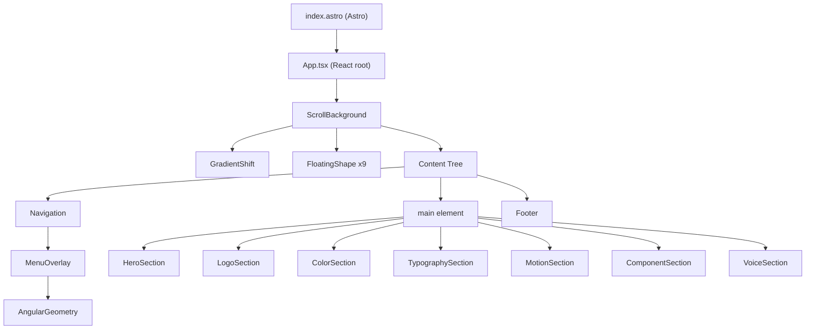

# Skill: Component Architecture

> Use when you need to understand how the React components are organized, how they interact, how scroll-driven effects work, or how to add/modify sections.

**Last verified: February 2026**
**Maintainer obligation: Update this file when you add new sections, change the component tree structure, or modify how effects/animations work.**

---

## Component Tree

The entire UI is a single React tree loaded as an Astro island via `client:only="react"`:



---

## Layer: Astro Shell

**File:** `src/pages/index.astro`

The Astro page is a thin wrapper. It imports `BaseLayout.astro` (HTML head, meta tags, global CSS) and renders the `App` component as a `client:only="react"` island. Astro does not server-render any React — everything happens in the browser.

```
BaseLayout.astro
  └── <App client:only="react" />
```

---

## Layer: App Root

**File:** `src/App.tsx`

The `App` component composes the page from top-level components in a fixed order:

1. `ScrollBackground` — Full-page visual effect (gradient + floating shapes)
2. `Navigation` — Fixed header with hamburger menu
3. `HeroSection` — Welcome content ("Software so good you can't help but smile")
4. `LogoSection` — Mark variants, downloads, usage rules
5. `ColorSection` — Color palette with tabbed Base/Accent/Pop
6. `TypographySection` — Type scale, weights, Montserrat + JetBrains Mono showcase
7. `MotionSection` — Motion principles with live interactive demos
8. `ComponentSection` — Button variants, sticky notes, card patterns
9. `VoiceSection` — Tone & voice guidelines with Do/Don't examples
10. `Footer` — Page footer

The sections are stacked vertically in a single scrollable page. Navigation uses anchor links (`#welcome`, `#logo`, `#colors`, `#typography`, `#motion`, `#components`, `#voice`) for smooth scrolling.

---

## Layer: Sections

Each section is in `src/components/sections/<Name>/` with:
- `<Name>.tsx` — The component implementation
- `index.ts` — Named re-export

### HeroSection (`#welcome`)

Displays the BFD mark, brand name, tagline ("Software so good you can't help but smile"), and welcome copy. Uses framer-motion for entrance animations (staggered fade-up). Has a "scroll to content" indicator button.

### LogoSection (`#logo`)

Shows mark variants (dark on light, light on dark), downloadable SVG assets, and clear space / minimum size rules (24×12px min). Mark is 6 horizontal bars + canton in upper-right (280×140 viewBox).

### ColorSection (`#colors`)

Features a **tabbed interface** (Base / Accent / Pop) showcasing the 80-10-10 color distribution. Each tab shows color swatches with hex codes, CSS variable names, and usage descriptions. Uses `window.scrollY` and `IntersectionObserver` for scroll-driven tab switching.

This is the component that requires `client:only="react"` (accesses `window` during render).

### TypographySection (`#typography`)

Displays the compact type scale with live examples at each size/weight, the Montserrat + JetBrains Mono font specimens, and a weight showcase (400, 500, 700, 900). Includes a light/dark theme toggle to demonstrate text colors on both backgrounds.

### MotionSection (`#motion`)

**BFD expansion (not in HW).** Live interactive demos of BFD motion principles:
- Fade-in-up entrance
- Stagger children
- Hover scale feedback
- Comic shadow hover (sticky note press effect)
- Marquee continuous scroll

Each demo shows the timing specification and easing curve alongside the live animation.

### ComponentSection (`#components`)

**BFD expansion (not in HW).** Showcases:
- **Button variants:** Default, Outline, Ghost, Link across sm/default/lg sizes
- **Sticky notes:** Yellow, green, purple with comic shadows and rotation
- **Card patterns:** Generic card with shadow-card hover transition

### VoiceSection (`#voice`)

**BFD expansion (not in HW).** Codifies BFD's voice with:
- "Do/Don't" writing examples
- Tone spectrum breakdown (Playful, Confident, Clear, Honest, Warm)
- The "Golden Rule" for brand messaging

---

## Layer: Effects

Visual effects that create the brand atmosphere. Located in `src/components/effects/`.

### ScrollBackground

**Files:** `ScrollBackground/` directory

A composite component with two sub-layers:

1. **GradientShift** — A full-viewport gradient that interpolates between two color states based on scroll position. Grayscale palette for BFD (lighter at top, darker as you scroll).

2. **FloatingShape** (x9 instances) — Subtle geometric shapes positioned across the viewport. They parallax-shift as you scroll, creating depth. Opacity is very low — sophisticated, not flashy.

Uses a custom `useScrollProgress` hook that tracks normalized scroll position (0 to 1).

### MenuOverlay

Full-screen navigation overlay that appears when the hamburger menu is opened. Features:
- Dark background (`#181B20` accent)
- Angular geometry decorations (corner brackets + diagonal lines via `AngularGeometry`)
- Animated nav items (staggered entrance with framer-motion)
- `AnimatePresence` for open/close transitions

### AngularGeometry

Decorative component that renders corner brackets and diagonal lines at viewport edges. Used inside `MenuOverlay` to reinforce the angular brand identity. Configurable via `CornerBracket` and `DiagonalLine` sub-components.

---

## Layer: UI Primitives

### Card (`src/components/ui/Card/`)

A generic card component with brand-standard styling (subtle rounding, card shadow). Used in ComponentSection for pattern demonstration.

### BrandLogo (`src/components/BrandLogo/`)

Renders the BFD mark as an inline SVG. Accepts `variant` prop (`dark`/`light`) and `size` prop (`sm`/`md`/`lg`/`xl`). The mark is 6 horizontal bars + canton (solid rectangle, upper-right), 280×140 viewBox.

---

## Animation System

All animations use **framer-motion**. Common patterns:

1. **Entrance animations**: Components animate in when they enter the viewport. Typically `opacity: 0 → 1` with a subtle `translateY`. Uses framer-motion's `motion` components with `initial`, `animate`, `transition` props.

2. **Scroll-driven effects**: `useScrollProgress` provides a 0-1 value based on scroll position. `GradientShift` and `FloatingShape` use this to interpolate colors and positions.

3. **Menu transitions**: `AnimatePresence` handles mount/unmount animations for the menu overlay and hamburger icon rotation.

4. **Hover feedback**: Interactive cards use `whileHover={{ scale: 1.02 }}` and shadow transitions.

**Easing curve**: Most animations use `cubic-bezier(0.16, 1, 0.3, 1)` — an expo-out curve that starts fast and eases gently. This is the signature motion feel.

---

## Adding a New Section

Step-by-step process:

1. **Create the directory:**
   ```
   src/components/sections/NewSection/
   ├── NewSection.tsx
   └── index.ts
   ```

2. **Implement the component:**
   ```tsx
   export function NewSection() {
     return (
       <section id="new-section" className="relative py-24 px-6 md:px-12">
         {/* Section content */}
       </section>
     );
   }
   ```

3. **Export from index.ts:**
   ```tsx
   export { NewSection } from "./NewSection";
   ```

4. **Add to App.tsx** (in the `<main>` block, in the desired order):
   ```tsx
   import { NewSection } from "@/components/sections/NewSection";
   // ...
   <main>
     <HeroSection />
     <LogoSection />
     <ColorSection />
     <TypographySection />
     <MotionSection />
     <ComponentSection />
     <VoiceSection />
     <NewSection />
   </main>
   ```

5. **Add navigation item** in `Navigation.tsx`:
   ```tsx
   const navItems = [
     { label: "Welcome", href: "#welcome" },
     { label: "Logo", href: "#logo" },
     { label: "Colors", href: "#colors" },
     { label: "Typography", href: "#typography" },
     { label: "Motion", href: "#motion" },
     { label: "Components", href: "#components" },
     { label: "Voice", href: "#voice" },
     { label: "New Section", href: "#new-section" },
   ];
   ```

---

## Component Conventions

- Every component directory has an `index.ts` barrel export
- Named exports (not default exports) for all components except `App.tsx`
- `@/` path alias for all imports
- Brand colors via Tailwind classes (`bg-bf-text`, `text-bf-muted`) or CSS vars (`var(--bf-text)`)
- Framer-motion for all animations (no CSS-only animations on interactive elements)
- Subtle rounding via `rounded-md` (8px) or `rounded-lg` (12px) — never `rounded-full` on containers

---

## Related Skills

- [Architecture](../architecture/SKILL.md) — Why React islands, why client:only
- [Design System](../design-system/SKILL.md) — Color tokens, typography, spacing
- [Development](../development/SKILL.md) — How to run and build
