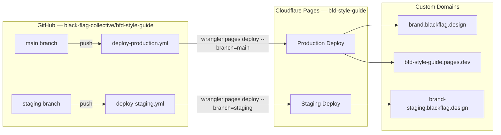

# Skill: Deployment & CI/CD

> Use when you need to understand how deployments work, debug a failed deployment, update GitHub secrets, manage DNS, or change the hosting configuration.

**Last verified: February 2026**
**Maintainer obligation: Update this file when you change the deployment pipeline, rotate secrets, add/remove custom domains, or modify the GitHub Actions workflows. Stale deployment docs cause outages.**

---

## Deployment Overview



---

## URLs

| Environment | URL | Branch | Trigger |
|-------------|-----|--------|---------|
| Production | `https://brand.blackflag.design` | `main` | Push to main |
| Staging | `https://brand-staging.blackflag.design` | `staging` | Push to staging |
| Pages Default | `https://bfd-style-guide.pages.dev` | `main` | Push to main |

---

## GitHub Actions Workflows

### Production (`.github/workflows/deploy-production.yml`)

- **Trigger:** Push to `main`
- **Concurrency:** `production-deploy` group, does NOT cancel in-progress (waits for current deploy to finish)
- **Steps:** Checkout → Node 22 setup → `npm ci` → `npm run build` → `wrangler pages deploy dist` → Health check (curl)
- **Health check:** Verifies HTTP 200 from `bfd-style-guide.pages.dev` after 15s wait

### Staging (`.github/workflows/deploy-staging.yml`)

- **Trigger:** Push to `staging`
- **Concurrency:** `staging-deploy` group, DOES cancel in-progress (faster iteration)
- **Steps:** Same build pipeline, no health check step

### Typical deployment time: ~60 seconds

---

## GitHub Secrets

These are set on the `black-flag-collective/bfd-style-guide` repository:

| Secret | What It Is | Where It Comes From |
|--------|-----------|---------------------|
| `CLOUDFLARE_API_KEY` | Cloudflare API Token (scoped for Pages + DNS) | Root `.env` as `CLOUDFLARE_API_TOKEN_2` |
| `CLOUDFLARE_ACCOUNT_ID` | Cloudflare account ID | Root `.env` as `CLOUDFLARE_ACCOUNT_ID_2` |

**To update secrets** (e.g., after key rotation):

```bash
# From the monorepo root
source .env
gh secret set CLOUDFLARE_API_KEY \
  --body "${CLOUDFLARE_API_TOKEN_2}" \
  --repo black-flag-collective/bfd-style-guide

gh secret set CLOUDFLARE_ACCOUNT_ID \
  --body "${CLOUDFLARE_ACCOUNT_ID_2}" \
  --repo black-flag-collective/bfd-style-guide
```

**Authentication method:** The `cloudflare/wrangler-action@v3` uses the `apiToken` input, which internally sets `CLOUDFLARE_API_TOKEN`. Do NOT set `CLOUDFLARE_EMAIL` or `CLOUDFLARE_API_KEY` as env vars in the workflow — only use the `with.apiToken` and `with.accountId` inputs.

---

## Cloudflare Pages Configuration

### Project Details

| Field | Value |
|-------|-------|
| Project name | `bfd-style-guide` |
| Production branch | `main` |
| Build output directory | `dist` |
| Default domain | `bfd-style-guide.pages.dev` |

### wrangler.toml

```toml
name = "bfd-style-guide"
pages_build_output_dir = "dist"
compatibility_date = "2024-12-01"
```

This file is minimal because the build is done in GitHub Actions, not by Cloudflare. Wrangler only uploads the pre-built `dist/` folder.

---

## DNS Configuration

All DNS is managed via Cloudflare (zone: `blackflag.design`, zone ID: `696fc3d8bcfd35c13fec17fff9bdd62b`).

| Type | Name | Value | Proxied |
|------|------|-------|---------|
| CNAME | `brand.blackflag.design` | `bfd-style-guide.pages.dev` | Yes |
| CNAME | `brand-staging.blackflag.design` | `bfd-style-guide.pages.dev` | Yes |

Both domains are registered as custom domains on the Cloudflare Pages project. Cloudflare handles SSL certificates automatically.

---

## Manual Deployment

If you need to deploy without GitHub Actions:

```bash
cd projects/bfd-style-guide
npm run build

# Load credentials from monorepo root .env
source ../../.env

# Deploy to production
CLOUDFLARE_API_TOKEN="${CLOUDFLARE_API_TOKEN_2}" \
  npx wrangler pages deploy dist --project-name=bfd-style-guide --branch=main

# Deploy to staging
CLOUDFLARE_API_TOKEN="${CLOUDFLARE_API_TOKEN_2}" \
  npx wrangler pages deploy dist --project-name=bfd-style-guide --branch=staging
```

---

## Troubleshooting

### Deployment fails with "Authentication error"

Check that `CLOUDFLARE_API_KEY` secret is set correctly. It should be the scoped API Token (`CLOUDFLARE_API_TOKEN_2` from root `.env`), NOT the Global API Key. The wrangler action uses the `apiToken` input which maps to `CLOUDFLARE_API_TOKEN` env var internally.

### Deployment fails with "Unknown internal error occurred"

This is a transient Cloudflare error. Re-run the failed workflow via `gh run rerun <run-id> --repo black-flag-collective/bfd-style-guide`. It typically succeeds on retry.

### Custom domain shows wrong content

Cloudflare Pages uses branch-based routing. The production domain serves the `main` branch deployment. If you deploy to a different branch name, it will not appear on the production domain.

### Build succeeds but site shows old content

Cloudflare has aggressive caching. Clear the cache in the Cloudflare dashboard (Caching → Purge Everything) or wait for TTL expiry.

---

## Related Skills

- [Architecture](../architecture/SKILL.md) — Why Cloudflare Pages was chosen
- [Development](../development/SKILL.md) — How to build locally before deploying
