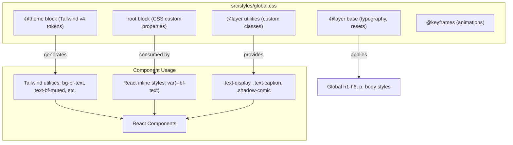

# Skill: Design System & Brand Tokens

> Use when you need to understand the color system, typography scale, spacing rules, or how to correctly apply brand tokens in CSS/Tailwind. This is the technical implementation reference for the brand spec in `.cursor/rules/black-flag-brand.mdc`.

**Last verified: February 2026**
**Maintainer obligation: Update this file when brand colors, typography, or design tokens change. This file must stay in sync with `src/styles/global.css` and `.cursor/rules/black-flag-brand.mdc`. If the brand evolves, all three must be updated together.**

---

## Token Architecture

The design system has two parallel token layers:



### Why Two Token Layers?

**`@theme` block** — Tailwind v4's native token system. Defining `--color-bf-text: #171717` here automatically generates `bg-bf-text`, `text-bf-text`, `border-bf-text`, etc. This is the primary way components consume brand colors via className props.

**`:root` block** — Standard CSS custom properties. React components that use inline styles or CSS `var()` expressions need these. For example, `ScrollBackground` uses `var(--bf-text)` in a JavaScript-driven style object. Tailwind's `@theme` tokens do not expose runtime CSS variables in the same way, so both are needed.

**They must stay in sync.** If you add a new color to `@theme`, also add it to `:root`.

---

## Color System: The 80-10-10 Rule

The palette is divided into three weight categories that should roughly follow an 80-10-10 distribution across any given screen.

### Base Colors (80% visual weight)

The monochromatic foundation. Clean, professional, breathable.

| Token | Hex | Tailwind Class | CSS Variable | Usage |
|-------|-----|----------------|-------------|-------|
| Background | `#FFFFFF` | `bg-bf-bg` | `var(--bf-bg)` | Page backgrounds |
| Surface | `#FAFAFA` | `bg-bf-surface` | `var(--bf-surface)` | Cards, elevated surfaces |
| Text | `#171717` | `text-bf-text` | `var(--bf-text)` | Primary text, headings |
| Muted | `#737373` | `text-bf-muted` | `var(--bf-muted)` | Secondary text, descriptions |
| Border | `#E5E5E5` | `border-bf-border` | `var(--bf-border)` | Dividers, card borders |

### Accent Colors (10% visual weight)

Brand ink — the signature BFD dark tone and warm paper.

| Token | Hex | Tailwind Class | CSS Variable | Usage |
|-------|-----|----------------|-------------|-------|
| Accent | `#181B20` | `bg-bf-accent` | `var(--bf-accent)` | Dark brand sections, heavy elements |
| Paper | `#F8F7F6` | `bg-bf-paper` | `var(--bf-paper)` | Warm paper-like backgrounds |
| Button | `#171717` | `bg-bf-button` | `var(--bf-button)` | Primary button backgrounds |
| Button Text | `#FFFFFF` | `text-bf-button-text` | `var(--bf-button-text)` | Text on primary buttons |

### Pop Colors (10% visual weight)

Playful moments. Sticky notes, success states, highlights. Never as primary UI chrome.

| Token | Hex | Tailwind Class | CSS Variable | Usage |
|-------|-----|----------------|-------------|-------|
| Warning/Yellow | `#FFC800` | `bg-bf-note-warning` | `var(--bf-note-warning)` | Sticky notes, warnings, highlights |
| Success/Green | `#5AE09A` | `bg-bf-note-success` | `var(--bf-note-success)` | Success states, positive callouts |
| Highlight/Purple | `#7B3EC4` | `bg-bf-note-highlight` | `var(--bf-note-highlight)` | Important highlights, featured notes |

### Dark Mode Tokens

Used for dark sections and the theme toggle in TypographySection.

| Token | Hex | Tailwind Class | CSS Variable |
|-------|-----|----------------|-------------|
| Dark BG | `#171717` | `bg-bf-dark-bg` | `var(--bf-dark-bg)` |
| Dark Surface | `#1C1C1C` | `bg-bf-dark-surface` | `var(--bf-dark-surface)` |
| Dark Text | `#F2F2F2` | `text-bf-dark-text` | `var(--bf-dark-text)` |
| Dark Muted | `#999999` | `text-bf-dark-muted` | `var(--bf-dark-muted)` |
| Dark Border | `#333333` | `border-bf-dark-border` | `var(--bf-dark-border)` |

### Functional

| Token | Hex | Usage |
|-------|-----|-------|
| Destructive | `#E04848` | Error states, delete actions |

---

## Typography

### Fonts: Montserrat + JetBrains Mono (Google Fonts CDN)

Loaded via `@import url(...)` at the top of `global.css`:

| Font | Weights | Usage |
|------|---------|-------|
| Montserrat | 400, 500, 600, 700, 900 | All UI text |
| JetBrains Mono | 400, 500 | Code blocks, tokens |

### Type Scale (base = 16px)

BFD uses a compact type scale. Unlike HW's 20px base, BFD starts at 16px for a tighter, more modern feel.

```
Display          3rem → 4.5rem (responsive)  / LH 1.1  / weight 700
h1               1.5rem (24px)  / LH 1.1  / weight 400  / -0.02em
h2               1.25rem (20px) / LH 1.25 / weight 400  / -0.01em
h3               1.125rem (18px)/ LH 1.3  / weight 500  / -0.01em
h4               1rem (16px)    / LH 1.35 / weight 500
Body             0.875rem (14px)/ LH 1.6  / weight 400
Caption          0.75rem (12px) / LH 1    / weight 500  / UPPERCASE / 0.1em tracking
```

### Key Typography Rules

1. **Hierarchy through weight and tracking.** h2 and h3 are close in size — weight (400 vs 500) and tracking differentiate them.
2. **Only Captions are uppercase.** Everything else is sentence case.
3. **Brand name is Title Case:** "Black Flag Design" (never all-caps or all-lowercase).
4. **Tight negative tracking** on headings (-0.02em to -0.01em) for a confident feel.
5. **Colors:** Light backgrounds → bf-text (#171717). Dark backgrounds → bf-dark-text (#F2F2F2).

### CSS Classes

| Class | Purpose |
|-------|---------|
| `.text-display` | 3rem → 4.5rem responsive display text (hero, major headings) |
| `.text-caption` | 0.75rem uppercase caption |
| `.text-caption-light` | Caption on light background (bf-text color) |
| `.text-caption-dark` | Caption on dark background (bf-muted color) |
| `.heading-on-dark` | bf-dark-text heading on dark backgrounds |
| `.font-montserrat` | Force Montserrat font family |
| `.font-jetbrains` | Force JetBrains Mono font family |

---

## Subtle Rounding (NOT Zero Radius)

Unlike HW's sharp-corners-only policy, BFD uses subtle rounding:

| Token | Value | Tailwind | Usage |
|-------|-------|----------|-------|
| `radius-sm` | 4px | `rounded-sm` | Small inputs, tags |
| `radius-md` | 8px | `rounded-md` | Cards, buttons |
| `radius-lg` | 12px | `rounded-lg` | Modals, large containers |
| `radius-xl` | 16px | `rounded-xl` | Hero cards, feature highlights |

This is a deliberate brand decision. The rounding creates a friendly, approachable feel that aligns with BFD's "playful confidence" personality.

---

## Shadows

| Token | Value | Usage |
|-------|-------|-------|
| `shadow-sm` | `0 1px 2px rgba(0,0,0,0.05)` | Subtle elevation |
| `shadow-md` | `0 4px 6px -1px rgba(0,0,0,0.1)` | Default elevation |
| `shadow-card` | `0 4px 24px rgba(0,0,0,0.06)` | Card resting state |
| `shadow-card-hover` | `0 8px 40px rgba(0,0,0,0.1)` | Card hover state |
| `shadow-float` | `0 20px 60px rgba(0,0,0,0.08)` | Floating/modal elements |
| `shadow-comic` | `4px 4px 0px rgba(0,0,0,0.95)` | Comic-style hard shadow |
| `shadow-comic-sm` | `2px 2px 0px rgba(0,0,0,0.95)` | Smaller comic variant |

### Comic Shadows — BFD Signature

The `shadow-comic` is BFD's unique personality element. Rules:
- Pair with `border-3` or `border-4` solid border
- Use on sticky notes, playful callouts, informal elements ONLY
- Never on formal UI chrome (nav, modals, form inputs)
- Add slight CSS rotation (±1-3deg) for a hand-placed feel

---

## Animations

Defined as CSS `@keyframes` in `global.css` and registered as Tailwind animation tokens in `@theme`:

| Animation | Duration | Easing | Usage |
|-----------|----------|--------|-------|
| `fade-in` | 0.5s | ease-out | Generic fade entrance |
| `slide-up` | 0.6s | ease-out | Content sliding up |
| `blur-in` | 0.6s | expo-out | Blur-to-sharp entrance |
| `scale-in` | 0.5s | expo-out | Scale from 0.95 to 1 |
| `float-up` | 1.0s | expo-out | Large vertical entrance |
| `marquee` | variable | linear | Continuous horizontal scroll |

**Expo-out easing:** `cubic-bezier(0.16, 1, 0.3, 1)` — the signature motion curve. Fast start, gentle landing.

**Reduced motion:** All animations are disabled when `prefers-reduced-motion: reduce` is set. This is handled globally at the bottom of `global.css`.

---

## Adding a New Token

To add a new color (example: "Info Blue" `#3B82F6`):

1. Add to `@theme` in `global.css`:
   ```css
   @theme {
     --color-bf-info: #3B82F6;
   }
   ```

2. Add to `:root` in `global.css`:
   ```css
   :root {
     --bf-info: #3B82F6;
   }
   ```

3. Use in components:
   ```tsx
   // Via Tailwind class
   <div className="bg-bf-info text-bf-button-text">Info</div>

   // Via CSS variable
   <div style={{ borderColor: 'var(--bf-info)' }}>Info</div>
   ```

4. Update `.cursor/rules/black-flag-brand.mdc` to document the new color.
5. Update this skill file.

---

## Related Skills

- [Architecture](../architecture/SKILL.md) — Why Tailwind v4, why two token layers
- [Components](../components/SKILL.md) — How components consume design tokens
