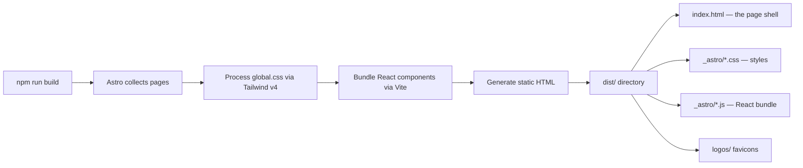

# Skill: Development Workflow

> Use when you need to run the project locally, understand the build process, add dependencies, or troubleshoot development issues.

**Last verified: February 2026**
**Maintainer obligation: Update this file when you change the dev server configuration, add new npm scripts, change the Node version requirement, or modify the build pipeline.**

---

## Quick Start

```bash
cd projects/bfd-style-guide
npm install
npm run dev
# Open http://localhost:4350
```

---

## Prerequisites

- **Node.js 22+** (the GitHub Actions CI uses Node 22; match it locally)
- **npm** (lockfile is `package-lock.json`, not yarn or pnpm)

---

## NPM Scripts

| Script | Command | Purpose |
|--------|---------|---------|
| `dev` | `astro dev --port 4350` | Start dev server with HMR on port 4350 |
| `build` | `astro build` | Generate static files in `dist/` |
| `preview` | `astro preview --port 4350` | Serve built `dist/` locally (post-build verification) |
| `check` | `astro check` | Run Astro's built-in type checker |

---

## Port Configuration

**Dev server: port 4350** (fixed, not the Astro default of 4321).

This is set in two places that must stay in sync:
1. `astro.config.mjs` — `server.port: 4350`
2. `package.json` — `--port 4350` flags on `dev` and `preview` scripts

Why 4350: The monorepo runs multiple Astro projects. 4321 is taken by hsw-site-cms, 4340 by hw-style-guide. 4350 avoids collision.

---

## Build Process



The build output is entirely static:
- `dist/index.html` — Single HTML page with Astro island markup
- `dist/_astro/` — Hashed CSS and JS bundles
- `dist/logos/` — SVG assets

Build time is typically under 2 seconds.

---

## Path Aliases

TypeScript path alias `@/*` maps to `./src/*`:

```json
// tsconfig.json
{
  "compilerOptions": {
    "paths": {
      "@/*": ["./src/*"]
    }
  }
}
```

All component imports use this: `import { Navigation } from "@/components/Navigation"`. This resolves through both Astro's Vite bundler and TypeScript.

---

## Dependencies

### Runtime Dependencies

| Package | Purpose | Notes |
|---------|---------|-------|
| `astro` | Framework | Static site generator |
| `@astrojs/react` | React integration | Enables React islands in Astro pages |
| `react` / `react-dom` | UI library | All interactive components are React 18 |
| `framer-motion` | Animation | Scroll effects, menu transitions, entrance animations |
| `lucide-react` | Icons | Menu hamburger icon (Menu, X) |
| `clsx` | Class merging | Conditional className logic |
| `tailwind-merge` | TW class merging | Prevents Tailwind class conflicts |

### Dev Dependencies

| Package | Purpose | Notes |
|---------|---------|-------|
| `tailwindcss` | CSS framework | v4 with CSS-based `@theme` configuration |
| `@tailwindcss/vite` | Vite plugin | Processes Tailwind via Vite pipeline |
| `@astrojs/check` | Type checking | Astro-specific type checker |
| `typescript` | Type checking | v5.6.3 |
| `@types/react` / `@types/react-dom` | React types | |

---

## Adding New Content Sections

To add a new brand guidelines section (e.g., "Iconography"):

1. Create `src/components/sections/IconographySection/IconographySection.tsx`
2. Create `src/components/sections/IconographySection/index.ts` with the named export
3. Import in `src/App.tsx` and place it in the `<main>` stack
4. Add a nav item in `src/components/Navigation/Navigation.tsx` (`navItems` array)
5. Give the section a matching `id` attribute for anchor scrolling

No routing changes needed — this is a single-page app with anchor-based navigation.

---

## Common Issues

### "window is not defined" during build

This happens if you change `client:only="react"` to `client:load` in `index.astro`. The React components use browser APIs (`window`, `document`, `IntersectionObserver`) during render. `client:only="react"` skips server-side rendering entirely. Do not change this.

### Tailwind classes not working

If you add a new Tailwind class and it does not apply:
1. Check that the color/token is defined in the `@theme {}` block in `global.css`
2. Tailwind v4 auto-generates utilities from `@theme` tokens. A token `--color-bf-foo: #123` automatically creates `bg-bf-foo`, `text-bf-foo`, etc.
3. For CSS variables used in `var()` expressions, they go in the `:root {}` block, not `@theme`.

### Port already in use

If port 4350 is occupied, check if another instance is running. Kill it rather than changing the port — the port is documented everywhere and changing it creates confusion.

### Vite type mismatch in astro.config.mjs

There is a known version mismatch between `@tailwindcss/vite` and Astro's bundled Vite. The `// @ts-ignore` on the `plugins` line in `astro.config.mjs` suppresses this. The build works correctly — it is purely a type-checking artifact.

---

## Related Skills

- [Architecture](../architecture/SKILL.md) — Why these technology choices were made
- [Deployment](../deployment/SKILL.md) — How the build output gets to production
- [Components](../components/SKILL.md) — How the React component tree works
